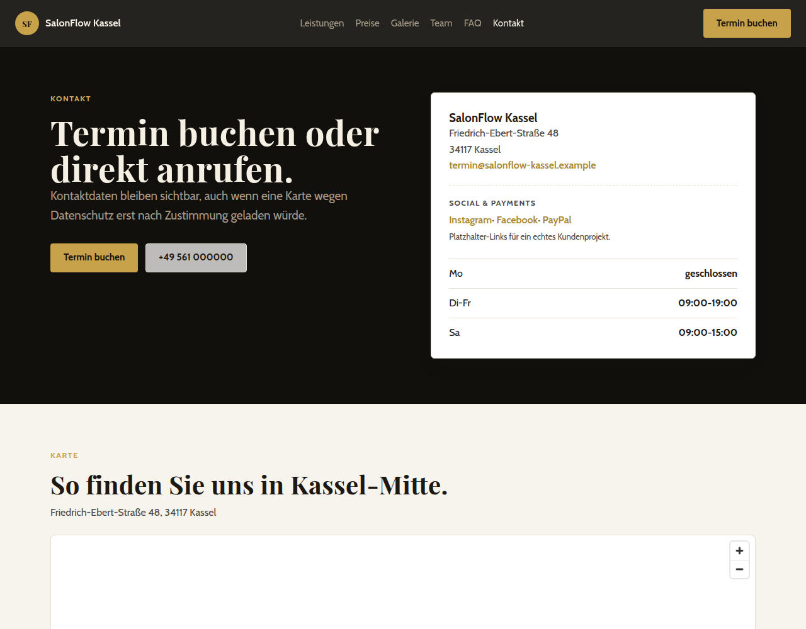

# SalonFlow Kassel ✂️

Realistisches **Portfolio-Projekt einer Website für einen fiktiven Friseursalon in Kassel.**
Aufgebaut wie ein echtes Kundenprojekt: Online-Termin, Leistungen, Preise, Galerie, Team,
Kontakt mit Karte, lokales SEO und CMS-ready Content.

> **Live-Demo:** https://clinquant-jalebi-8c402e.netlify.app/

> Das ist ein **Lern- und Präsentationsprojekt**, kein echter Salon. Alle Inhalte sind
> originale Platzhalter. Rechtsseiten (Impressum, Datenschutz, AGB) sind Platzhalter und
> müssen vor einem echten Launch in Deutschland ersetzt werden.

---

## 📸 Screenshots

| Startseite | Leistungen | Kontakt mit Karte |
|---|---|---|
|  |  |  |

---

## 🎯 Für wen ist das Projekt

Das Projekt zeigt, wie **Websites für lokale Geschäfte in Deutschland** entwickelt werden:

- **Angehende Frontend-Entwickler:innen** — wie ein realistisches Kundenprojekt mit Struktur,
  Inhalten und Deployment „wie im echten Leben“ aufgebaut ist.
- **Potenzielle Kunden (Salons, Studios, Handwerker)** — als lebendiges Beispiel einer
  Website mit Online-Termin, Karte und lokaler SEO-Struktur.
- **Studierende und Mentor:innen** — als Demonstration einer bewussten Stack-Entscheidung
  und des Ergebnisses eines schlanken SDD-Prozesses.

Die typische Zielgruppe eines künftigen echten Projekts sind ähnliche Geschäfte:
Friseursalons, Beauty-Salons, Nagelstudios, mobile Dienstleister.

---

## 🧱 Warum diese Technologie

| Entscheidung | Warum |
|---|---|
| **Astro** | Liefert echtes statisches HTML/CSS/JS — schnelle Ladezeiten und bestes SEO. Komponentenbasiert, kein JavaScript im Standardfall. |
| **TypeScript** | Typisierte Content-Daten und Serviceschicht — weniger Fehler, sichereres Refactoring. |
| **Tailwind CSS** | Schnelle Entwicklung und konsistentes Design ohne überflüssiges CSS. |
| **Astro Content Collections** | „CMS-ready“ Daten (Leistungen, Preise, Team, Galerie, FAQ) mit Schema-Validierung — Content kann auf Decap CMS abgebildet werden. |
| **Decap CMS + Netlify Identity** | Content-Änderungen ohne Git für die Website-Betreiberin. |
| **Vitest** | Tests für reine Funktionen (Daten-Normalisierung, Content-Integrität) — Schutz vor Regressionen. |
| **Netlify (statisches Hosting)** | Kostenloser Deploy, Auto-Build aus Git, kein Serverbetrieb. |
| **OpenStreetMap-Embed** | Karte ohne API-Key und ohne Drittanbieter-Tracking (privacy-freundlicher für DE). |
| **JSON-LD Schema.org** | Lokales SEO: LocalBusiness + GeoCoordinates für Suchmaschinen. |

---

## ✅ Vorteile

- **Sehr schnelle Website** — statisches HTML, kein schwerer Runtime.
- **Gutes SEO out-of-the-box** — Sitemap, Canonical, JSON-LD, lokale Keywords.
- **Content ohne Entwickler** — Decap CMS über Netlify Identity (git-gateway).
- **Klare Struktur** — Daten sind von Templates getrennt, alles wird per Schema validiert.
- **Einfacher Deploy** — Push ins Git → Netlify baut neu und veröffentlicht.
- **Günstiger Betrieb** — keine Server oder Abos für statische Seiten.
- **Privacy-freundlich für Deutschland** — OSM statt Google Maps, Content ohne Analytics standardmäßig.
- **Testbarkeit** — Content-Validierung und Unit-Tests für den Service-Layer.

## ⚠️ Nachteile

- **Nicht für echte Dynamik gebaut** — für die Live-Terminbuchung braucht es einen externen
  Anbieter (StudioBookr / Treatwell / Calendly), nicht nur eine statische Form.
- **CMS standardmäßig einfach** — Decap eignet sich für Text-Content; für komplexe
  Block-Editoren braucht es Nacharbeit.
- **Keine Serverlogik** — Formulare/Backend (falls nötig) laufen über Netlify Functions
  oder externe Dienste.
- **Tailwind v4 ist frisch** — das Team muss das neue Token-Modell kennen.
- **Hybride Content-Collections** — die Kombination „Dateien + CMS“ erfordert Schema-Disziplin.

---

## 🚀 Schnellstart

```bash
npm install
npm run dev        # lokaler Dev-Server
npm test           # Vitest: Unit + Content-Integrität
npm run build      # test -> astro check -> astro build
npm run preview    # gebaute Website prüfen
```

`npm run build` ist die Pipeline `npm test && astro check && astro build`.

---

## 📁 Struktur

```
src/
  content/            # CMS-ready Daten (Leistungen, Preise, Team, Galerie, FAQ, Settings)
  components/         # UI-Komponenten (Hero, ServiceGrid, GalleryGrid, BookingBand, PriceList)
  layouts/            # BaseLayout (Fonts, Header/Footer, JSON-LD)
  lib/                # Service-Layer (cms.ts, normalize.ts — reine Funktionen)
  pages/              # Startseite, Leistungen/*, Preise, Galerie, Team, FAQ,
                      # Kontakt, Termin, AGB, Impressum, Datenschutz, Booking-Demo
tests/                # Vitest-Tests
public/admin/         # Decap CMS (config + index.html)
netlify.toml          # Netlify-Deploy-Konfiguration
```

---

## 🔗 Deploy und CMS

- **Netlify**: `netlify.toml` → Build `npm run build`, Publish `dist`, Node 22.
  Details: `docs/netlify-deploy.md`.
- **Decap CMS**: `/admin/` über Netlify Identity + Git Gateway.
  Details: `docs/cms-and-booking.md`.
- **Terminbuchung**: Buttons führen zu `/termin/`; Anbieter und URL kommen aus
  `src/content/settings/salon.json` (Override über `.env`).

---

## ⚖️ Rechtlicher Hinweis

Das Projekt **kopiert keine** echte Marke, Texte oder Medien. Impressum / Datenschutz / AGB
sind Platzhalter für Lernzwecke. Vor einem echten Launch in Deutschland müssen sie durch
für das Geschäft relevante Inhalte ersetzt und mit der Eigentümerin abgestimmt werden.